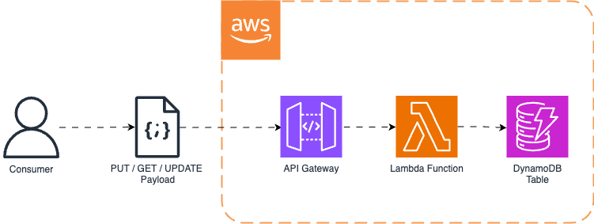
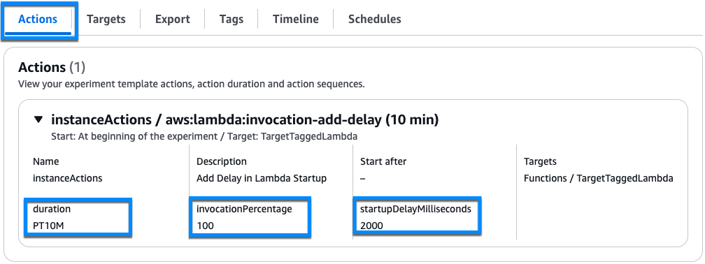
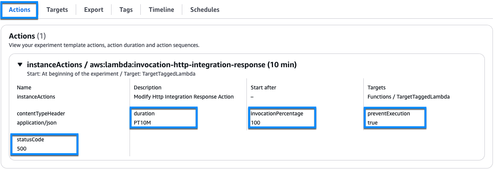
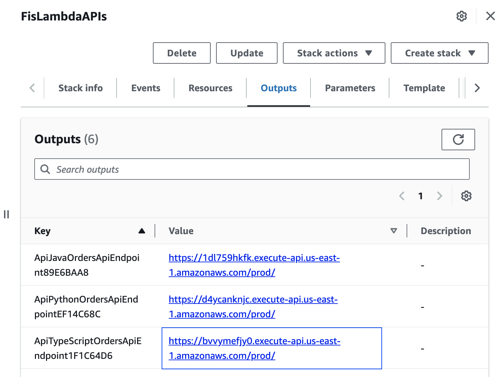
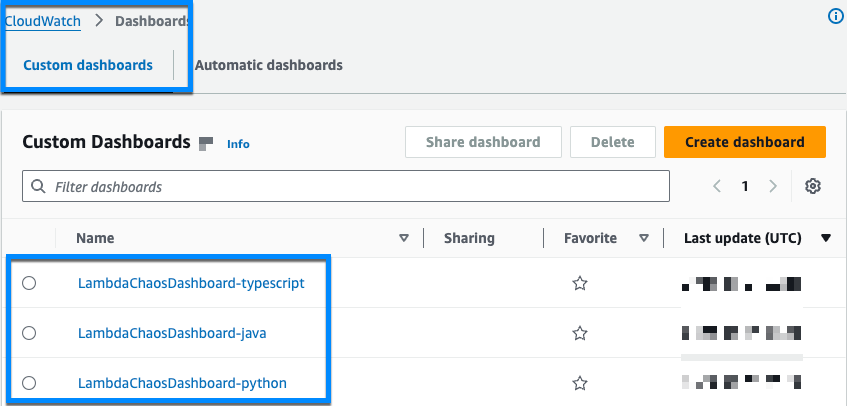
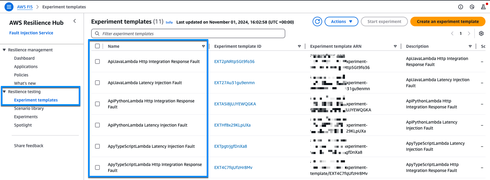
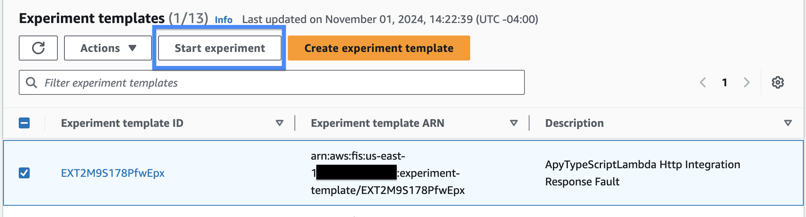
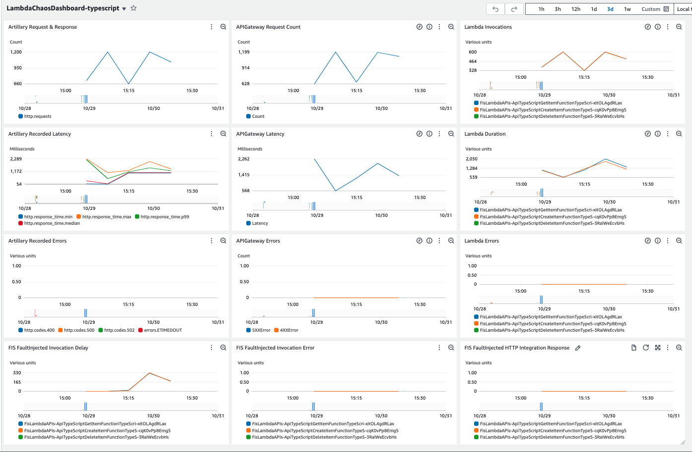

# AWS Lambda Actions for AWS FIS

## Introduction
The AWS Fault Injection Service (FIS) supports AWS Lambda Actions which allows you to inject faults into
the Lambda execution environments. As part of their resilience plan, Lambda fault actions
enable you, our AWS customers, to demonstrate that their Lambda-based applications operate
as expected during periods of AWS impairment, in response to misconfigurations, or in
response to bad data. 

## Prerequisites
- [CDK Toolkit](https://docs.aws.amazon.com/cdk/v2/guide/getting_started.html) & bootstrapped AWS environment
- [docker](https://docs.docker.com/engine/install/)
- [mvn](https://maven.apache.org/run.html)

> **[!IMPORTANT]**
> You need to deploy the stack to an AWS Region where [AWS FIS is supported](https://docs.aws.amazon.com/general/latest/gr/fis.html).

> **[!IMPORTANT]**
> This application deploy publicly available endpoints you'll use to interact with the application. Don't forget to cleanup the deployment following steps below to avoid unnecessary costs. 

## Solution Overview

### Sample Application

This repository contains three (3) serverless applications and FIS experiment templates using FIS Lambda Actions.

Sample applications are simple CRUD APIs that allow you to manage orders.  They are built using Amazon API Gateway, AWS Lambda, and Amazon DynamoDB. It provides simple Create, Read, Update, and Delete (CRUD) functionality to manage orders. 



The different APIs and its Lambda functions are implemented using three different runtimes: Node.js, Python and Java.

### FIS Templates
This repository also deploys the FIS experiment templates which carry out the Lambda actions. Separate experiment templates will be deployed for each of the sample applications. There will be two FIS templates per sample application.

1. **Lambda Latency Injection Fault**  - this FIS template utilize the  *[aws:lambda:invocation-add-delay](https://docs.aws.amazon.com/fis/latest/userguide/fis-actions-reference.html#invocation-add-delay)* action. 
It is configured to inject 2000ms (2 seconds) latency into 100% of the request for 10 minutes.



2. **Lambda Http Integration Response Fault** -  FIS template utilize the*[aws:lambda:invocation-http-integration-response](https://docs.aws.amazon.com/fis/latest/userguide/fis-actions-reference.html#invocation-http-integration-response)*. 

It is configured to inject error responses of status code 500 for 100% of the request for 10 minutes. It will also prevent the actual execution of the Lambda Function. 



### Observability Dashboards
Repository also implements observability dashboards for each of the CRUD applications deployed.


## Getting started

The CDK code deploys all necessary resources for the experiments. 

See the official [AWS FIS Actions](https://docs.aws.amazon.com/fis/latest/userguide/fis-actions-reference.html) documentation page for more information.

### Setup

#### Deploy resources
To deploy resources, please execute the following command in the CLI environment, where you have already logged into the AWS account. 

```
cd cdk-lambda-chaos
npm ci
cdk deploy --all --parameters FisLambdaAPIs:fisLambdaLayerARN='arn:aws:lambda:us-east-1:211125607513:layer:aws-fis-extension-x86_64:9'
cd ..
```

Once deployment is completed - you'll be presented with the API endpoints. Please make a note of them. 


#### Install dependencies for load generation
Please execute the following command in the CLI environment

```
cd load-generation
npm install -g artillery@latest
npm ci

```

#### Configure Variables for the experiment
<!-- FisLambdaAPIs stack outputs the URL of deployed API which is exposing the AWS Lambda functions that you want to run the chaos experiments on. The screenshot below shows the output from FisLambdaAPIs stack. You can take the URL as highlighted in the screenshot as an example:
 -->

As the next step, you need to configure environment variable API_URL with the API endpoint of the CRUD application that you want to run the chaos experiment for.

Use the API endpoint you've captured before and remove the trailing "/" from the url. Then set this as an environment variable as shown below. 

```
export API_URL='https://<api_id>.execute-api.<region>.amazonaws.com/prod'
```

This would be used by the Artillery load generation script.

**NOTE:** *You just have to set the base path without leading '/' as '/' is added within the load generation configuration.*

### Run the experiment

#### Generate load
**Note!** *Make sure to you have set the API_URL environment variable as shown above.*

Before you run the chaos engineering experiments using FIS, ensure that your application has reached steady state. See [Basic principles and guidelines](https://docs.aws.amazon.com/fis/latest/userguide/getting-started-planning.html#planning-basic-principles) to learn more on this. In this example, you can run load generation using following command to achieve steady state:

```
artillery run load-generation-config.yml
```

By default, this sends 4 requests per second for 10 minutes. You can change the during as well as number of requests for load generation in ``load-generation-config.yml`` file. See [Artillery documentation](https://www.artillery.io/docs/get-started/first-test#define-load-phases) for more details.

Go to the [AWS CloudWatch Console](https://console.aws.amazon.com/cloudwatch/) where you'll find three dashboards.


Select the dashboard for the the application you are testing and observe the steady state. 


#### Start the experiment
Go to the [AWS Resilience HUB Console](https://console.aws.amazon.com/resiliencehub/home). Navigate to the **Resilience testing**  and select **Experiment templates**. You'll see the list of the FIS Experiment Templates deployed for you.



Select FIS experiment template for the experiment and integration you'd like execute and press **Start Experiment**  again press on **Start Experiment** button on the next screen to run the experiments.




#### Monitor results

Once you have run the load generation script and started the experiment, you can observe your application's behavior by looking at different metrics included in the [CloudWatch Dashboards](https://console.aws.amazon.com/cloudwatch/). To get a holistic view of your application behavior, this dashboard includes 
* metrics from Artillery load generation including number of requests and corresponding responses received, latency of response, any errors recorded by load generation script. This represents the user's perspective of your application.
* corresponding metrics from API Gateway and Lambda Function that comprise the API we are invoking from load generation script and,
* metrics from FIS extension showing the number of faults injected by the experiment.

Below is an example of running the 'Lambda Latency Injection Fault' experiment template.



The Dashboard is organized in four rows three columns:
* First row represents the requests from load generation, corresponding API Gateway request count and corresponding Lambda invocations. They should represent and same count for steady state.
* Second row shows response times recorded by load generation, latency from API Gateway and Lambda duration. You should see a correlation among these metrics when you run *aws:lambda:invocation-add-delay* experiment.
* Third row shows API errors recorded by the load generation script, errors reported by API Gateway and errors in Lambda function invocations. If you run *aws:lambda:invocation-http-integration-response* experiment, you should see  correlation in metrics in this row.
* The last row represents *FaultInjected* metric. Based on the experiment you are running, you should see a correlation with either "FIS FaultInjected Invocation Delay" or "FIS FaultInjected HTTP Integration Response" graph.

NOTE: This dashboard includes only *FaultInjected* metric. You can explore [all EMF metrics emitted by AWS FIS Extension](https://docs.aws.amazon.com/fis/latest/userguide/use-lambda-actions.html) in *aws-fis-extension* Custom namespace in CloudWatch.


### Cleanup
Run the following command from the `cdk-lambda-chaos` folder.
```
cdk destroy --all
```

## Contributing
See [CONTRIBUTING](CONTRIBUTING.md) for more information.

## License
This library is licensed under the MIT-0 License. See the LICENSE file.
